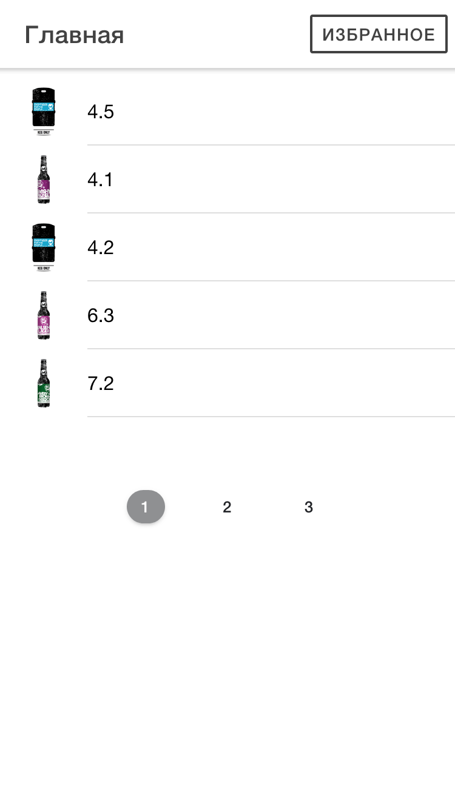
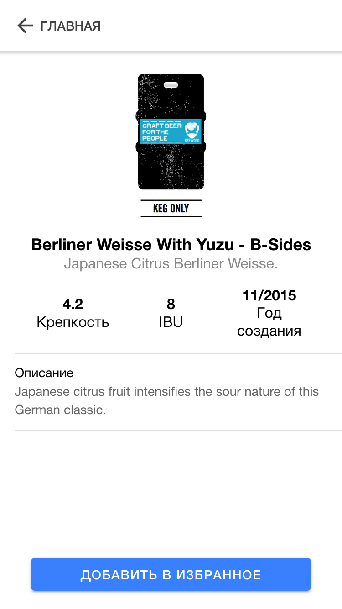
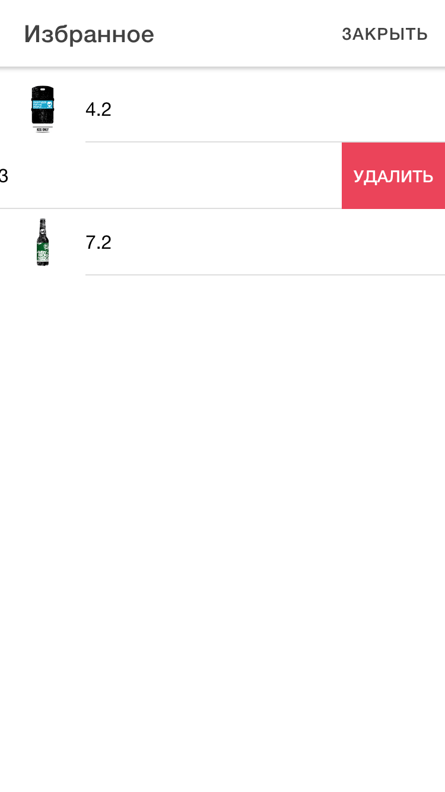

# Beverages Test Task

Приложение для просмотра информации о пиве.

- Ionic/React
- Typescript
- Capacitor/Android
- localStorage API

## Демо

Демо в браузере: [github.io ↗](https://ilyumzhinov.github.io/beverageTestTask)

## Установка

Необходимо для установки:

- Node
- Android Studio, Android 7 SDK

Установка зависимостей:

```bash
npm install
```

### Запуск Web

Запустить сервер `localhost:3000`:

```bash
npm start
```

### Компиляция Android APK

1. Transpile TS в исходники:
   
   ```bash
   npm run build
   ```

2. Добавить Capacitor/Android:
   
   ```bash
   npx cap add android
   ```

3. Скопировать исходники и родить debug apk:
   
   ```bash
   npx cap copy android
   cd android && ./gradlew assembleDebug && cd ..
   ```

4. APK живёт по адресу: `android/app/build/outputs/apk/debug/app-debug.apk`

### Скриншоты

**Главная**



**Экран напитка**


**Избранные напитки**
